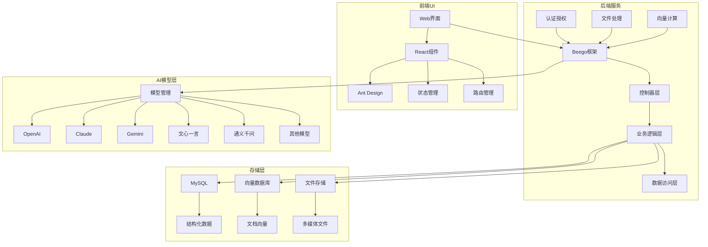

# Casibase - 开源AI知识库系统

<div align="center">
<h3>基于RAG(检索增强生成)的开源AI知识库系统，支持Web UI和企业级SSO，兼容OpenAI、Azure、LLaMA、Google Gemini、HuggingFace、Claude等多种AI模型</h3>
</div>

## 系统架构



## 主要特性

### 1. 多模型支持

- OpenAI (GPT-3.5/4系列)
- Google Gemini
- Anthropic Claude
- Meta LLaMA
- 百度文心一言
- 阿里通义千问
- 讯飞星火
- 智谱ChatGLM
  等20+种主流AI模型

### 2. 核心功能

- RAG(检索增强生成)
- 知识库管理
- 多模态处理(文本/图像/视频)
- 向量检索
- 企业级单点登录(SSO)
- 完整的权限管理
- 多语言支持
- 实时对话
- 文档处理

### 3. 技术特点

- **前端**

  - React 18
  - Ant Design 5.x
  - 响应式设计
  - 组件化架构
- **后端**

  - Go + Beego框架
  - Python + Flask
  - RESTful API
  - WebSocket实时通信
- **存储**

  - MySQL数据库
  - 向量数据库
  - 文件存储系统

### 4. 系统优势

- 开源免费
- 部署灵活(支持Docker)
- 高度可定制
- 企业级安全
- 完善的文档
- 活跃的社区

## 快速开始

### 在线演示

- 聊天机器人: https://demo.casibase.com
- 管理界面: https://demo-admin.casibase.com

### 本地部署

1. 克隆仓库

```bash
git clone https://github.com/casibase/casibase
```

2. 安装依赖

```bash
cd casibase
go mod tidy
cd web && yarn install
```

3. 启动服务

```bash
# 后端
go run main.go

# 前端
cd web && yarn start
```

## 技术架构详解

### 1. 前端架构

- **UI框架**: React + Ant Design
- **状态管理**: React Hooks
- **路由**: React Router
- **请求**: Axios
- **国际化**: i18next
- **编辑器**: CodeMirror
- **图表**: ECharts
- **数学公式**: KaTeX

### 2. 后端架构

- **Web框架**: Beego
- **认证**: OAuth2.0 + JWT
- **数据库**: MySQL
- **缓存**: Redis
- **文件存储**: 本地/云存储
- **向量计算**: 支持多种向量数据库

### 3. AI模型集成

- 统一的Provider接口
- 支持同步/异步调用
- 模型配置灵活
- 支持模型混合调用
- 完整的错误处理

### 4. 数据处理流程

1. **文档上传**

   - 支持多种格式
   - 自动文本提取
   - 文件分块处理
2. **向量化处理**

   - 文本分段
   - Embedding生成
   - 向量索引构建
3. **知识检索**

   - 语义相似度计算
   - 上下文关联
   - 动态权重调整
4. **答案生成**

   - 提示词优化
   - 上下文组装
   - 结果优化

## 项目不足与改进方向

### 1. 现存问题

- 大规模并发支持需要优化
- 向量检索性能可提升
- 部分模型集成需要完善
- 跨语言处理能力有限

### 2. 改进方向

- 引入微服务架构
- 优化向量索引结构
- 增强多语言处理
- 提升实时性能
- 增加更多AI模型支持

## 联系方式

- Discord: https://discord.gg/5rPsrAzK7S
- 文档: https://casibase.org

## 开源协议

[Apache-2.0](https://github.com/casibase/casibase/blob/master/LICENSE)
